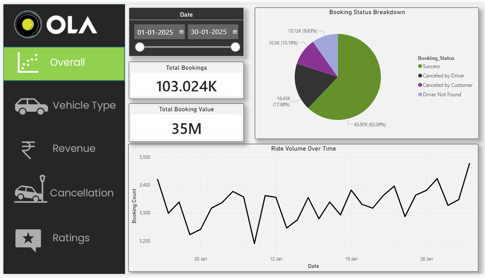
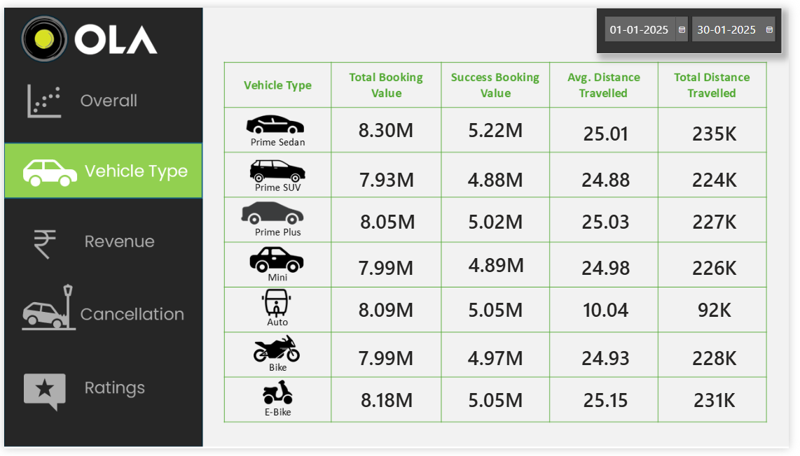
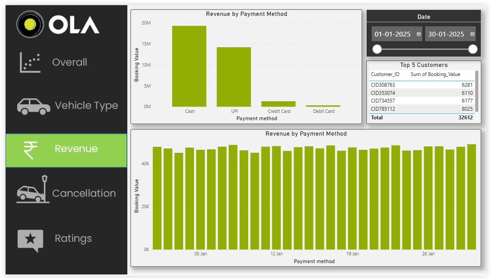
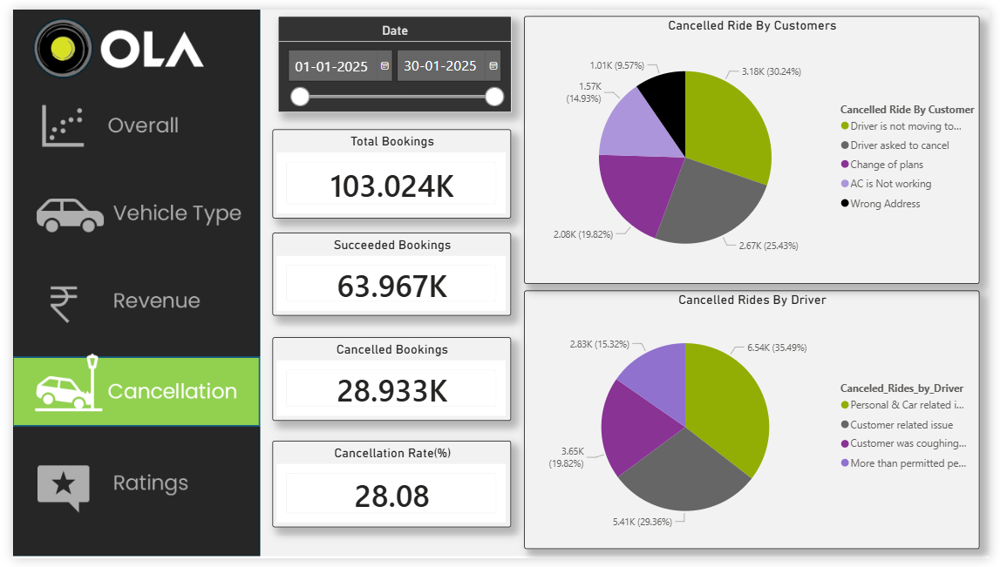
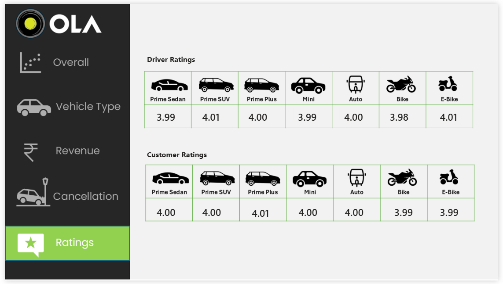

# Ola_Bookings-Analysis

<h2>📊 OLA Bengaluru Ride Analytics Dashboard – Data Analytics Project</h2>

This project showcases a complete end-to-end data analytics workflow for Bengaluru OLA ride bookings — covering data generation, cleaning, SQL analysis, and Power BI dashboard visualization.
The goal is to deliver meaningful insights into ride volumes, cancellations, revenue, and customer/driver behavior.

<h2>📌 Project Overview </h2>

This project analyzes 1,00,000+ OLA ride bookings generated for Bengaluru city across one month.
It includes realistic booking behavior such as:

• Ride volume fluctuations (weekends & match days increased load)

• Customer & driver cancellations

• Incomplete rides & reasons

• Vehicle type distribution

• Payment methods

• Driver/Customer ratings

• Booking success ratio (maintained at 62%)

All data is cleaned, transformed, analyzed using SQL, and visualized through an interactive Power BI dashboard.

<h2>🚀 Objectives: </h2>

• Clean, transform & validate data

• Analyze booking trends using SQL

• Build an interactive Power BI dashboard featuring:

• Time-series analysis

• Cancellation analysis

• Ratings distribution

• Ride distance & value insights

<h2>⚙️ Tools & Technologies </h2>

• Power BI

• Power Query (M Language)

• SQL (MySQL)

• Excel / CSV

<h2>📁 Folder Structure </h2>

├── Data/  
│   └── OLA_Bengaluru_Bookings.csv  
│ 
├── SQL/  
│   └── ola_queries.sql  
│ 
├── Dashboard/  
│   └── OLA_Analytics_Dashboard.pbix  
│ 
├── Screenshots/  
│   ├── Overall.png  
│   ├── Vehicle_type.png  
│   ├── Revenue.png  
│   ├── Cancellation.png  
│   └── Ratings.png  
│ 
├── README.md

## 🧠 Key Dashboard Insights

### **1. Overall View**
- Total Bookings: **103K**
- Total Booking Value: **35M**
- Booking Status Breakdown: Success, Driver Cancelled, Customer Cancelled, Driver Not Found
- Ride Volume Over Time shows weekend & match-day spikes

---

### **2. Vehicle Type Analysis**
Each vehicle category shows:

- Total Booking Value  
- Success Booking Value  
- Avg Distance Travelled  
- Total Distance Covered  

---

### **3. Revenue Insights**
- Revenue by Payment Method  
- Daily revenue trend (~₹45K–₹50K/day)  
- Top 5 customers by booking value  

---

### **4. Cancellation Analysis**
Separate analysis for:

- **Cancelled by Customers**  
- **Cancelled by Drivers**  

With reasons and proportional distribution.

---

### **5. Ratings Overview**
Driver & customer ratings per vehicle type.

---

<h2>🧠 Business Impact (Use Cases) </h2>

This dashboard helps:

🚦 Operations Teams – Monitor booking volume & peak hours

👨‍🔧 Driver Management – Track cancellation patterns & driver behavior

💸 Finance Teams – Identify high-value customers & revenue leakage

🧭 Product Teams – Improve ride allocation algorithms (VTAT/CTAT insights)

📍 City Planners – Understand mobility patterns within Bengaluru

<h2>Dashboard Preview</h2>
🟢 Overall View 

🚗 Vehicle Type Analysis

💰 Revenue Insights

⚠️ Cancellation Analysis

⭐ Ratings Overview

